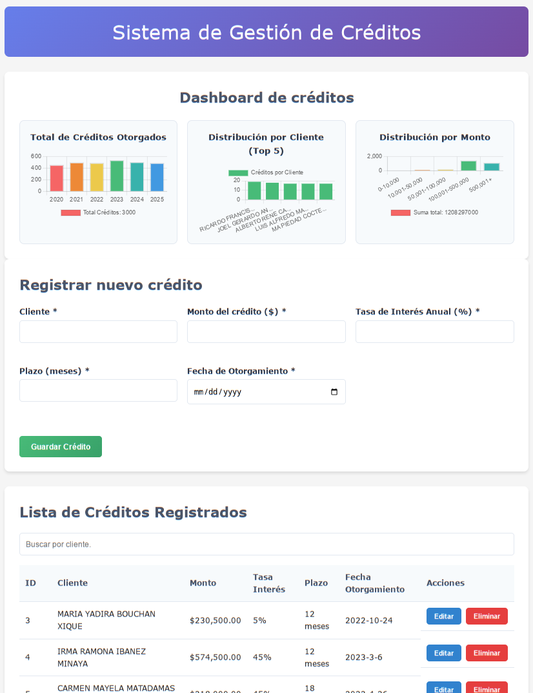

# Desarrollo de una Herramienta de Registro de Créditos
<div align="justify"> 
Se presenta el desarrollo de  una herramienta web en Python-Flask la cual permite registrar créditos, el almacenamiento de la información en una base de datos SQLite y mostrar una gráficas con información relevante sobre los créditos otorgados.
<br />

## Características
- ✅ Aplicación WEB con capacidad de crear, leer, actualizar y eliminar datos de créditos bancarios (CRUD).
- ✅ Editar información previamente almacenada en la base de datos
- ✅ Visualizar información relevante a través de gráficas mediante componentes de Chart.js
- ✅ Se añade un script para generar una base de datos de prueba con datos ficticios.

## Instalación
1. Clonar el repositorio
```bash
git clone https://github.com/tu_usuario/registro_cred_py.git
```
2. Navegar al directorio del proyecto
```bash
cd registro_cred_py
```
3. Crear un entorno virtual y activar el entorno virtual (opcional pero recomendado) 
```bash
python -m venv venv
```
```bash
# En Windows
venv\Scripts\activate

# En Linux o macOS
source venv/bin/activate
```
5. Instalar las dependencias
```bash
pip install -r requirements.txt
```
6. Ejecutar la aplicación
```bash
cd backend/
python -m app
```
Para añadir un nuevo crédito desde la terminal se ejecuta el siguiente comando:
```bash
curl -X POST http://localhost:5000/creditos \
  -H "Content-Type: application/json" \
  -d '{
    "cliente": "Osvaldo C",
    "monto": 50000,
    "tasa_interes": 12.5,
    "plazo": 12,
    "fecha_otorgamiento": "2023-10-15"
  }'
```
Para obtener una lista completa de los créditos se ejecuta el siguiente comando:
```bash
curl -X GET http://localhost:5000/creditos
```
Y para obtener un crédito específico (donde 1 es el ID del crédito):
```bash
curl -X GET http://localhost:5000/creditos/1
```
Para actualizar un crédito existente (donde 1 es el ID del crédito):
```bash
curl -X PUT http://localhost:5000/creditos/1 \
  -H "Content-Type: application/json" \
  -d '{
    "monto": 60000,
    "plazo": 12,
  }'
```
Finalmente para eliminar un crédito existente (donde 1 es el ID del crédito):
```bash
curl -X DELETE http://localhost:5000/creditos/1
``` 
7. Para abrir la aplicación web, se ejecuta el archivo `index.html` de la carpeta `frontend`.
```bash
cd frontend
```
A continuación, se muestra la interfaz gráfica de la aplicación. La aplicación web muestra en primer lugar las gráficas para los créditos otorgados ordenado por año, un top de los 5 clientes con más créditos y una distribución de los créditos por rango de monto. Posteriormente, se presenta el formulario para añadir nuevos créditos. Finalmente, se muestra la lista de créditos existentes con la opción de eliminarlos o editarlos, al editarlos, la sección de formularios se llena automáticamente con la información del crédito seleccionado y permite realizar modificaciones.
<p align="center">
	
</p>

### Uso de la web-app
1. Añadir un nuevo crédito: Completar el formulario con los datos del crédito y hacer clic en "Guardar Crédito".
<p align="center">
	
</p>
2. A continuación, se muestra en la parte inferior la lista de créditos existentes, donde se puede eliminar o editar cada uno de ellos.
<p align="center">
	
</p>
3. Editar un crédito existente: Hacer clic en el botón "Editar" junto al crédito que se desea modificar. Esto llenará automáticamente el formulario con la información del crédito seleccionado, permitiendo realizar cambios.
<p align="center">
	
</p>
4. Eliminar un crédito existente: Hacer clic en el botón "Eliminar" junto al crédito que se desea eliminar. Esto abrirá un cuadro de diálogo de confirmación para asegurar que se desea eliminar el crédito. Finalmente, se eliminará el crédito de la lista.
<p align="center">
	
</p>

### Creación de una base de datos
Se ejecuta el comando `python -m genDB` para crear la base de datos dentro del directorio `genDatabase/`. Se pueden modificar parámetros como el número de registros a crear y el número de personas a generar. 

****Nota:**** Los nombres de los clientes generados son ficticios y no corresponden a personas reales.